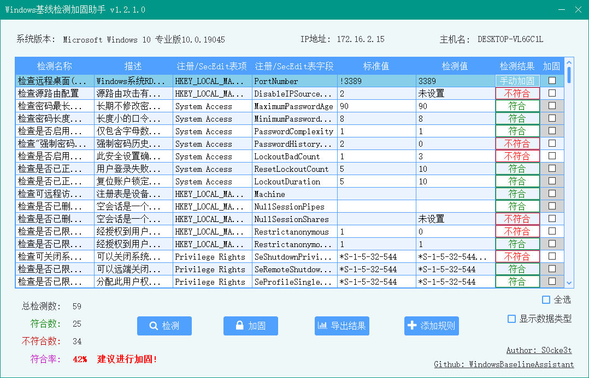

<p align="center">


<p>

# WindowsBaselineAssistant

WindowsBaselineAssistant(WBA)是一个用于检测和加固Windows安全基线的辅助工具,借助此工具你可以免去繁琐的手工检测和加固操作,实现一键检测和加固你的Windows安全基线,并可以导出检测或加固结果,解放你的双手~

## 截图




## 工具运行要求

- .Net Framework 4.0及以上
## 项目依赖库

- SunnyUI 3.6.3
- SunnyUI.Common 3.6.3
- System.ValueTuple 4.5.0
- NPOI 2.5.1
- Costura.Fody 4.1.0
## 自定义规则

WBA支持自定义规则以适应不同环境下的检测需求  

WBA的所有规则位于`item.xml`文件中,其中检测规则分为`registry`和`secedit`两种,判定规则分为`fixed,enum,greaternumber,lessnumber,array,equals`六种.  

### 规则格式

**registry(读取注册表)**

```xml
<item>
	<name>检查源路由配置</name>
	<description>源路由攻击有源地址欺骗、IP欺骗等,为了提高系统的可靠性,需要检查是否启用正确配置源路由攻击保护.</description>
	<type>registry</type>
	<registry>HKEY_LOCAL_MACHINE\SYSTEM\CurrentControlSet\Services\Tcpip\Parameters</registry>
	<regitem>DisableIPSourceRouting</regitem>
	<standard>2</standard>
	<assessment>enum</assessment>
	<valuetype>dword</valuetype>
</item>
```
|   名称   |   解释   |
| ---- | ---- |
|   name   |   规则名称   |
|   description   |   规则描述   |
|   type   |   检测类型   |
|   registry   |   检测项的注册表路径   |
|   regitem   |   检测的注册表项   |
|   standard   |   标准值   |
|   assessment   |   判定规则(见: 判定规则)   |
| valuetype | 注册表数据类型(见: 数据类型) |


**secedit(读取config.cfg信息)**
```xml
<item>
	<name>检查密码最长使用期限</name>
	<description>长期修改密码会提高密码暴露风险,所以为了提高系统的保密性.需要检查密码最长使用期限.</description>
	<type>secedit</type>
	<mark>MaximumPasswordAge</mark>
	<standard>90</standard>
	<assessment>greaternumber</assessment>
</item>
```
|   名称   |   解释   |
| ---- | ---- |
|   name   |   同上   |
|   description   |   同上   |
|   type   |   同上   |
|   mark   |   secedit文件中的键   |
|   standard   |   同上   |
|   assessment   |   同上   |

**附加标识**

manual: 用于标识检测项需要手动进行加固

```xml
<item>
	<manual>1<manual>
</item>
```


ignore: 用于标识检测项为已忽略

```xml
<item>
	<ignore>1<ignore>
</item>
```


**判定规则**

|   标识符   |   判定规则解释   |   判定结果   |
| ---- | ---- | ---- |
|   fixed   |   检测项的标准值为一个不固定值   |   手动加固   |
|   enum   |   检测项的标准值为一个枚举类型   |   等于枚举值: 符合 反之: 不符合   |
|   greaternumber   |  检测项的标准值大于此值时    |   符合 反之: 不符合   |
|   lessnumber   |   检测项的标准值小于此值时   |   符合 反之: 不符合   |
|   array   |   检测项的标准值是一个数组(多行)   |   相同: 符合 反之: 不符合   |
|   equals   |   检测项的标准值等于检测值   |   相同: 符合 反之: 不符合   |

**数据类型**

| 注册表类型   | 工具映射类型 | 类型解释                                       |
| ------------ | ------------ | ---------------------------------------------- |
| String       | string       | 字符串类型                                     |
| ExpandString | expandstring | 可扩展字符串类型的注册表值，通常包含了环境变量 |
| Binary       | 暂不支持     | 二进制数据类型                                 |
| DWord        | dword        | 32位整数类型                                   |
| QWord        | qword        | 64位整数类型                                   |
| MultiString  | multistring  | 多行字符串类型                                 |
| Unknown      | 默认         | 未知类型                                       |
| None         | 暂不支持     | 没有特定类型                                   |

**例**

如现在要检测`重新传输的TCP连接阈值`   
检测类型为`检索注册表  `
检索的注册表路径为`HKEY_LOCAL_MACHINE\\SYSTEM\\CurrentControlSet\\services\\Tcpip\\Parameters`   
检测项为`TcpMaxHalfOpenRetried`   
标准值为`400`   
数据类型为`DWord`  
检测值要小于此值时`判定符合`    

```xml
<item>
	<name>检查处于SYN_RCVD 状态下,且至少已经进行了一次重新传输的TCP连接阈值</name>
	<description>xxxxxx</description>
	<type>registry</type>
	<registry>HKEY_LOCAL_MACHINE\SYSTEM\CurrentControlSet\services\Tcpip\Parameters</registry>
	<regitem>TcpMaxHalfOpenRetried</regitem>
	<standard>400</standard>
	<assessment>lessnumber</assessment>
    <valuetype>dword</valuetype>
</item>
```

**更多示例见item.xml**

## 致谢

 - [SunnyUI  .Net界面库](https://github.com/yhuse/SunnyUI)
 - [System.ValueTuple  实现了C#中元组的底层类型](https://www.nuget.org/packages/System.ValueTuple/4.5.0/ReportAbuse)
 - [NPOI  POI的.Net实现,用于读写office文档](https://github.com/nissl-lab/npoi)


## FAQ

#### WBA适用所有Windows版本嘛?

很显然这是不可能的,每个Windows版本的注册表和secedit信息不尽相同,WBA不可能做到适配所有系统

#### 为什么加固后,通过Windows管理界面查看配置项未进行更改?

这通常是你的规则和你的Windows系统不匹配造成的,你需要重新查找检测项在注册表和secedit中的检测位置,并更新的你的规则库

